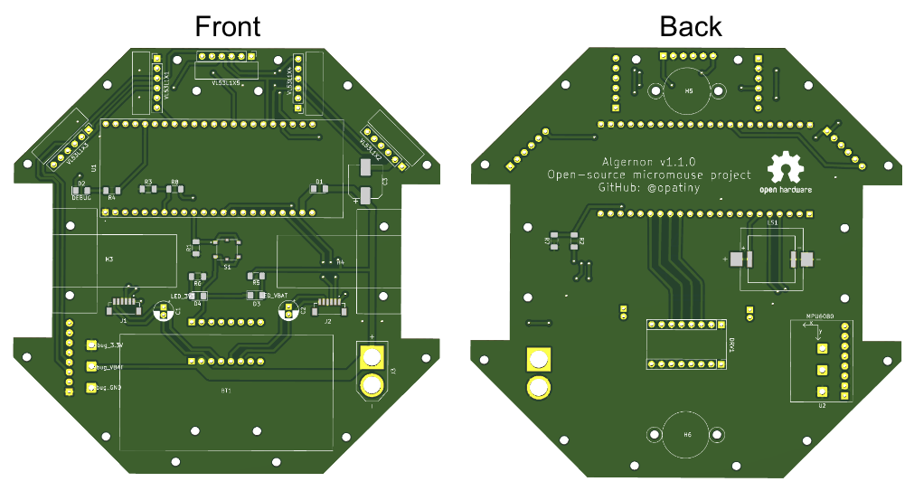
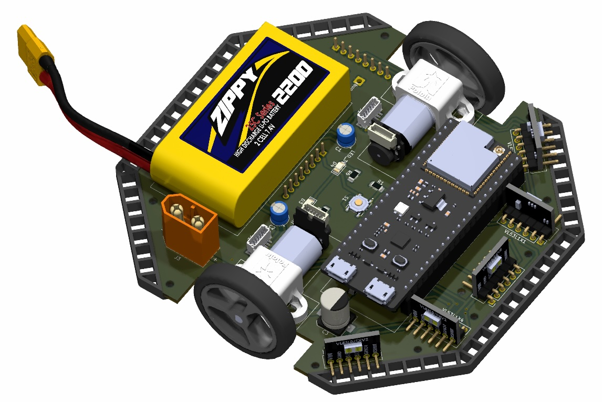
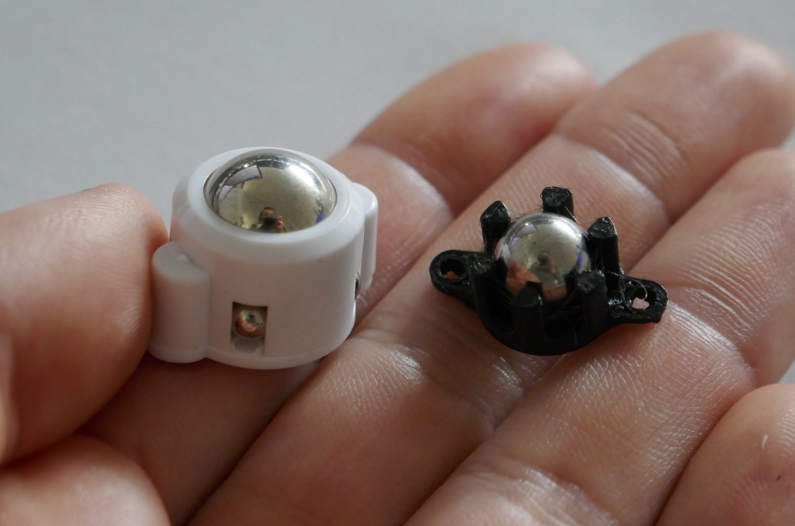
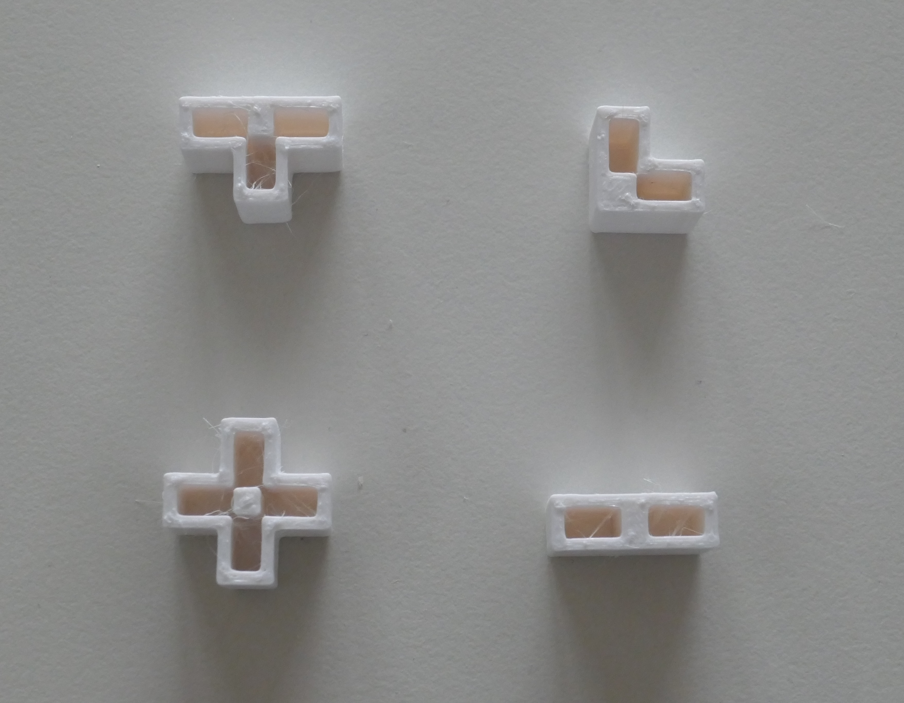

# Algernon: A custom micromouse robot

Main repository for my bachelor's thesis project.

## Abstract

This project was inspired by the micromouse competitions, in which small autonomous maze-solving robots compete to solve an unknown maze in the shortest possible time. The main focus of the project was to design a micromouse from scratch, which implied electrical and mechanical design, as well as the manufacturing of our own custom PCB. A physical prototype of the robot was fully assembled and tested. The robot implements 5 ToF distance sensors, an accelerometer and two brushed DC motors with encoders. The microcontroller is an ESP32-S3, and a 2P1S LiPo battery is used as a power supply. On the software side, all of the sensors were tested independently and are functional. A basic odometry task was also implemented, which allows to track the robot's position, and speed regulation of the wheels was added. What is more, a remote debug interface using WiFi was programmed in order to visualize the robot's status in real time.

## Repository structure

These are the main folders in this repository:

- `docs`: All sorts of documentation about the project, as well as the datasheets and useful images of the components used.
- `electronics`: Contains all the KiCad files of the PCB.
- `mechanics`: All files related to mechanical design and manufacturing. Also contains all of our custom maze files.
- `matlab`: Calculations and plot realized during the project.
- `software`: Not the actual micro-controller software. This only contains a few tests done using the Micromouse Simulator tool.

## Software

All the software of the robot is in its own repository: [opatiny/ms-software](https://github.com/opatiny/micromouse).

## Electronic design

The robot's PCB was fully designed in KiCad. The list of all the components used can be found in [docs/electronics/mouseHardware.md](./docs/electronics/mouseHardware.md).

Render of the final PCB

3D view of the completed robot

## Mechanical design

The mechanical design is relatively simple since the PCB is the main structural element. We just had to design our own caster wheel, that are 3D printed out of PETG, and custom bumpers, 3D printed out of flexible filament.

Comparison of commercial and custom caster wheel

Close-up of the bumper

## Custom maze

In order to test our robot, we designed our own maze. The walls are 3mm MDF, spray painted white. The connectors are 3D printed out of PETG. Additional "bridge" parts are use to ensure the walls are parallel, and at the right distance from each other. All the parts were designed in solidworks.

The four types of connectors

Example of a small section of maze, integrating one of the "bridge" parts

