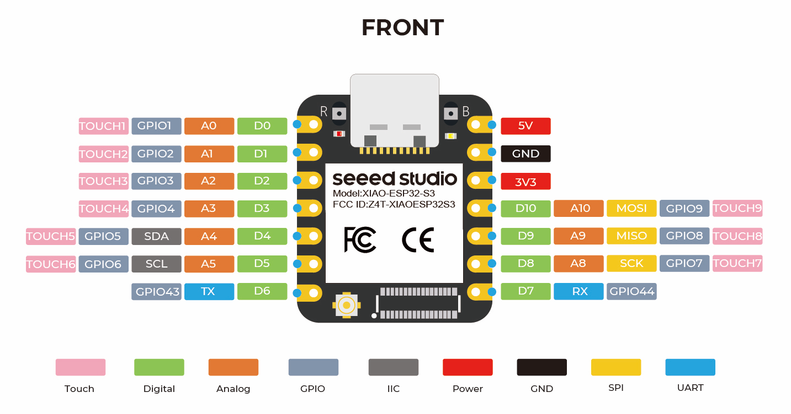

# Pins mapping of the ESP32-S3-DEVKITC (Espressif) - PCB v1.0.0

## Left side (USB connectors at the bottom)

| Jumper pin | Silk label | Pin value | Usage                    |
| ---------- | ---------- | --------- | ------------------------ |
| J1_1       | 3V3        | 3V3       | MCU output voltage (Vin) |
| J1_2       | 3V3        | 3V3       | MCU output voltage (Vin) |
| J1_3       | RST        | RST       |                          |
| J1_4       | 4          | GPIO4     | SDA                      |
| J1_5       | 5          | GPIO5     | SCL                      |
| J1_6       | 6          | GPIO6     |                          |
| J1_7       | 7          | GPIO7     |                          |
| J1_8       | 15         | GPIO15    |                          |
| J1_9       | 16         | GPIO16    |                          |
| J1_10      | 17         | GPIO17    |                          |
| J1_11      | 18         | GPIO18    |                          |
| J1_12      | 8          | GPIO8     |                          |
| J1_13      | 3          | GPIO3     |                          |
| J1_14      | 46         | GPIO46    |                          |
| J1_15      | 9          | GPIO9     |                          |
| J1_16      | 10         | GPIO10    | Front-right ToF XSHUT    |
| J1_17      | 11         | GPIO11    | Right ToF XSHUT          |
| J1_18      | 12         | GPIO12    | Front ToF XSHUT          |
| J1_19      | 13         | GPIO13    | Left ToF XSHUT           |
| J1_20      | 14         | GPIO14    |                          |
| J1_21      | 5V         | 5V0       | Connected to battery     |
| J1_22      | G          | GND       | Common ground            |

## Right side (USB connectors at the bottom)

Note: ToF are VL53L1X time of flight distance sensors.

| Jumper pin | Silk label | Pin name | Usage                                     |
| ---------- | ---------- | -------- | ----------------------------------------- |
| J3_1       | G          | GND      | Common ground                             |
| J3_2       | TX         | GPIO43   |                                           |
| J3_3       | RX         | GPIO44   |                                           |
| J3_4       | 1          | GPIO1    |                                           |
| J3_5       | 2          | GPIO2    | Blink debug LED                           |
| J3_6       | 42         | GPIO42   | Encoder right, pin 2                      |
| J3_7       | 41         | GPIO41   | Encoder right, pin 1                      |
| J3_8       | 40         | GPIO40   |                                           |
| J3_9       | 39         | GPIO39   |                                           |
| J3_10      | 38         | GPIO38   | Not usable (RGB LED)!! Right motor, pin 2 |
| J3_11      | 37         | GPIO37   | Not usable (memory)!! Right motor, pin 1  |
| J3_12      | 26         | GPIO36   | Not usable (memory)!! Left motor, pin 2   |
| J3_13      | 35         | GPIO35   | Not usable (memory)!! Left motor, pin 1   |
| J3_14      | 0          | GPIO0    |                                           |
| J3_15      | 45         | GPIO45   |                                           |
| J3_16      | 48         | GPIO48   | Buzzer                                    |
| J3_17      | 47         | GPIO47   | Push button                               |
| J3_18      | 21         | GPIO21   | Encoder left, pin 1                       |
| J3_19      | 20         | GPIO20   |                                           |
| J3_20      | 1          | GPIO19   | Encoder left, pin 2                       |
| J3_21      | G          | GND      | Common ground                             |
| J3_22      | G          | GND      | Common ground                             |

- "For boards with **Octal SPI** flash/PSRAM memory embedded **ESP32-S3-WROOM-1/1U** modules, and boards with ESP32-S3-WROOM-2 modules, the **pins GPIO35, GPIO36 and GPIO37** are used for the internal communication between ESP32-S3 and SPI flash/PSRAM memory, thus **not available for external use**." - https://docs.espressif.com/projects/esp-idf/en/stable/esp32s3/hw-reference/esp32s3/user-guide-devkitc-1.html

## Other

- RGB LED on pin 38
