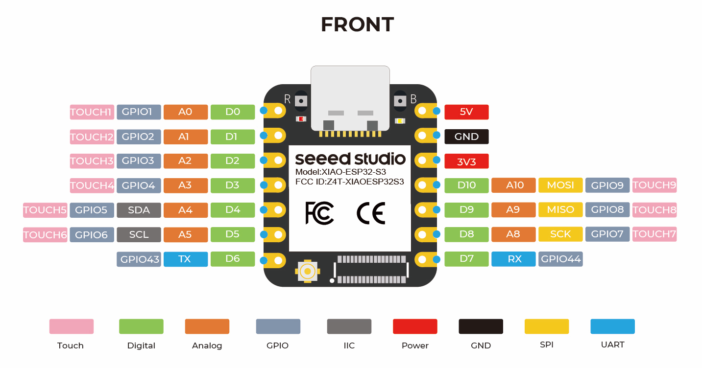

# Pins attribution of the ESP32-S3 (Xiao)

| Pin | Usage                   |
| --- | ----------------------- |
| D0  | Encoder left, pin 1     |
| D1  | Encoder left, pin 2     |
| D2  | Encoder right, pin 1    |
| D3  | Encoder right, pin 2    |
| D4  | SDA                     |
| D5  | SCL                     |
| D6  | Voltage divider battery |
| D7  | Left motor, pin 1       |
| D8  | Left motor, pin 1       |
| D9  | Right motor, pin 1      |
| D10 | Right motor, pin 2      |
| 5V  | Not connected           |
| GND | Common ground           |
| 3V3 | MCU input voltage       |

## Pins attribution of GPIO expander

- 5x distance sensor XSHUT pin (OUTPUT)
- 1x buzzer
- RGB LEDs?
